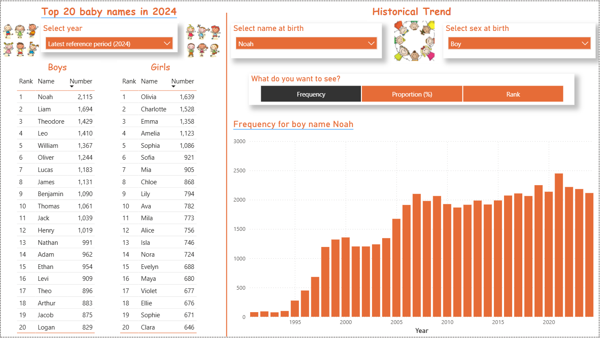
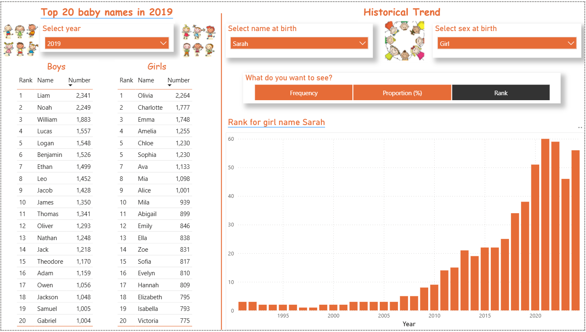

# A Replica of Statistics Canada Baby Names Dashbaord
## Overview 
This project recreates the Statistics Canada Baby Names Observatory dashboard using publicly available raw data from Statistics Canada birth name records from 1991-2024. Both the original dashboard and data can be found [here](https://www150.statcan.gc.ca/n1/pub/71-607-x/71-607-x2023021-eng.htm)

The dashboard enables users to explore name popularity trends over time, compare rankings by gender, and analyze frequency and proportion metrics through dynamic filtering and interactive visuals.
## Dashboard Preview

## Dynamic Metric Selection

## Objective
The objective of this project was to recreate the functionality of the Statistics Canada Baby Names Observatory while applying data modeling, transformation, and business intelligence techniques in Power BI.

Key objectives include: 
* Transforming raw government data into a cleaned data set using Power Query (ETL process)
* Designing a scalable data model to support time-series and demographic analysis
* Developing an interactive report page that enable users to explore naming trends
* Implementing dynamic reporting elements such as slicers, filtered visuals, and dynamic text boxes that update based on user selections
* Enabling multi-metric analysis through DAX field parameters, allowing users to switch between Frequency, Rank, and Proportion (%) within a single visual
* Enhancing user experience through controlled visual interactions to ensure clear and intentional data filtering behavior
* Improving dashboard storytelling through context-aware titles and labels that respond dynamically to filter selections
* Creating a dedicated year dimension table to ensure complete historical coverage from 1991–2024

## Key Skills Demonstrated
* Power BI dashboard development and report design
* Power Query data transformation and ETL process
* DAX measures, calculated columns, and field parameters for dynamic updating
* Data modeling for time-series analysis
* Interactive reporting and data storytelling
* Dynamic text, titles, and context-aware visualizations

## Data Cleaning With Power Query
The data was cleaned and transformed in Power Query Editor to create an analysis-ready data model:

- Selected relevant fields:
  - Year (REF_DATE)
  - Sex at birth
  - First name at birth
  - Indicator
  - VALUE

- Standardized categorical values:
  - “Male” replaced with “Boy”
  - “Female” replaced with “Girl”

- Normalized name formatting by capitalizing each name

- Pivoted dataset on Indicator to separate:
  - Frequency
  - Rank
  - Proportion (%)

- Applied correct data types:
  - Frequency & Rank set as Whole numbers
  - Proportion (%) set as Decimal numbers

## Dashboard Features
* Interactive slicers for Year, Name (search-enabled), and Sex at birth 
* Dynamic Top 20 ranking tables by gender
* Time-series analysis of baby name popularity from 1991–2024
* Dynamic metric switching using DAX field parameters
* Dynamic titles and text responding to filter context
* Controlled visualization interactions for improved usability and clarity

  ## Key Learning Outcomes
* Built an end-to-end BI pipeline from raw government data to interactive dashboard
* Applied ETL principles and improved data modeling and transformation skills using Power Query
* Strengthened DAX proficiency for dynamic measures
* Developed experience in dashboard UX design and storytelling with data

